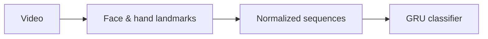

# Presentation Attitude Assessment

[한국어](README.md) · [Run locally](#try-it) · [Documentation](docs/README.md)

**From a presentation video to a whole-video attitude assessment.**

A portfolio reconstruction of work at Creverse, using face and hand movement to
classify presentation attitude as **appropriate** or **inappropriate**.
Company code, private data and trained weights are not included.

> **Current stage:** The pipeline runs, but there is no validated attitude classifier yet.
> Training and evaluation use synthetic coordinates. The upload demo shows extracted features.

## How it works



| Step | Implementation |
|---|---|
| Read video | FFmpeg → NumPy, sampled at 5 fps without intermediate image files |
| Prepare features | MediaPipe landmarks, face-relative XY normalization and moving average |
| Train & evaluate | PyTorch GRU for variable-length videos; F1, ROC-AUC and per-video predictions |
| Serve | FastAPI upload API, SQLite queue and a separate analysis worker |

The worker reuses the classifier across jobs. Each video gets its own MediaPipe
tracking session and fresh GRU hidden state.

## Try it

Run from the **monorepo root**. Install [uv](https://docs.astral.sh/uv/) first;
the workspace selects Python 3.13.

### Start with synthetic data

No video or detector download is needed after installing Python dependencies.

```sh
uv sync --locked
uv run --locked presentation-training-smoke \
  --output .local-data/presentation-attitude/first-run
```

This creates sample sequences, trains a small GRU on CPU and saves `training/best.pt`
and `training/summary.json`. Use a new output path for each run.

Next: [evaluate the saved model](docs/guides/evaluation.md), including on Mac MPS.
Synthetic metrics check the implementation; they do not measure presentation attitude quality.

<details>
<summary><strong>Analyze your own video</strong></summary>

Install FFmpeg and make sure `ffmpeg` and `ffprobe` are on `PATH`.

```sh
uv run --locked presentation-process /path/to/video.mp4 \
  --output .local-data/presentation-attitude/my-video
```

The first run downloads and verifies MediaPipe models. Results are saved as
`sequence.jsonl` and `summary.json`. This command extracts features only.
Use a new output directory. [Output format →](docs/guides/whole_video_pipeline.md)

</details>

<details>
<summary><strong>Open the upload demo</strong></summary>

Requires FFmpeg and Node.js/npm in addition to the Python environment.

```sh
npm ci --prefix presentation_attitude_assessment/frontend
npm run build --prefix presentation_attitude_assessment/frontend
uv run --locked presentation-serve
```

Start the worker in a second terminal:

```sh
uv run --locked presentation-worker
```

Open [localhost:43187/ui/](http://127.0.0.1:43187/ui/).
Upload a video to inspect face/hand detection and usable-feature ratios.

This is a local, single-worker service. Actual attitude inference requires a trained
attitude checkpoint; synthetic test checkpoints are rejected.
[Serving configuration →](docs/guides/serving.md)

</details>

## Explore the code

Python code lives in [`src/presentation_attitude`](src/presentation_attitude).

| Area | Start here |
|---|---|
| Model and inference | [`models/`](src/presentation_attitude/models) |
| Data and preprocessing | [`data/`](src/presentation_attitude/data) |
| End-to-end workflows | [`pipelines/`](src/presentation_attitude/pipelines) |
| Video input and tracking | [`vision/`](src/presentation_attitude/vision) |
| API and worker | [`serving/`](src/presentation_attitude/serving) |

[Architecture and public interfaces](docs/guides/python_structure.md) ·
[Annotation criteria](docs/guides/presentation_attitude.md) ·
[Data availability](docs/data/data_access_review.md)

Detailed guides are currently in Korean.

## Checks

```sh
uv run --locked python -m unittest discover -s presentation_attitude_assessment/tests -v
```

**75 tests passed** in the latest code verification (2026-09-08), covering video
input, preprocessing, training, evaluation and job processing.
[Verification details and lint commands](docs/guides/python_structure.md#검사-명령)

[← Back to the monorepo](../README.en.md)
