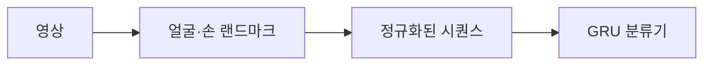

# Presentation Attitude Assessment

[English](README.en.md) · [실행하기](#실행하기) · [문서](docs/README.md)

**발표 영상을 입력받아, 영상 전체의 발표 태도를 평가합니다.**

크레버스에서 수행했던 업무를 바탕으로 만든 포트폴리오 재구현입니다.
얼굴과 손의 움직임을 이용해 발표 태도를 **적절 / 부적절**로 분류하는 구조입니다.
회사 코드·내부 데이터·학습 가중치는 포함하지 않습니다.

> **현재 단계:** 파이프라인은 실행되지만, 검증된 태도 분류 모델은 아직 없습니다.
> 학습·평가는 합성 좌표를 사용하며, 업로드 데모는 추출된 특징을 보여줍니다.

## 처리 흐름



| 단계 | 구현 |
|---|---|
| 영상 읽기 | FFmpeg → NumPy, 중간 이미지 저장 없이 5fps 샘플링 |
| 특징 준비 | MediaPipe 랜드마크, 얼굴 기준 XY 정규화와 이동평균 |
| 학습·평가 | 가변 길이 영상을 처리하는 PyTorch GRU, F1·ROC-AUC·영상별 예측 |
| 서빙 | FastAPI 업로드 API, SQLite 큐, 별도 분석 워커 |

워커는 작업 간 분류 모델을 재사용합니다. MediaPipe 추적 세션과 GRU hidden state는
영상마다 새로 시작합니다.

## 실행하기

**모노레포 루트**에서 실행합니다. 먼저 [uv](https://docs.astral.sh/uv/)를 설치하세요.
워크스페이스가 Python 3.13을 선택합니다.

### 합성 데이터로 시작하기

Python 의존성 설치 후에는 영상이나 검출 모델 다운로드 없이 실행할 수 있습니다.

```sh
uv sync --locked
uv run --locked presentation-training-smoke \
  --output .local-data/presentation-attitude/first-run
```

샘플 시퀀스를 생성하고 작은 GRU를 CPU에서 학습한 뒤, `training/best.pt`와
`training/summary.json`을 저장합니다. 실행할 때마다 새 출력 경로를 지정하세요.

다음 단계: [저장된 모델 평가하기](docs/guides/evaluation.md). Mac MPS 실행도 안내합니다.
합성 데이터의 지표는 코드 동작을 확인하는 값이며 실제 발표 태도 성능은 아닙니다.

<details>
<summary><strong>내 영상 분석하기</strong></summary>

FFmpeg를 설치하고 `ffmpeg`, `ffprobe`가 `PATH`에 등록돼 있는지 확인하세요.

```sh
uv run --locked presentation-process /path/to/video.mp4 \
  --output .local-data/presentation-attitude/my-video
```

처음 실행하면 MediaPipe 모델을 내려받아 검증합니다. 결과는 `sequence.jsonl`과
`summary.json`에 저장됩니다. 이 명령은 특징 추출만 수행합니다.
새 출력 디렉터리를 사용하세요. [출력 형식 →](docs/guides/whole_video_pipeline.md)

</details>

<details>
<summary><strong>업로드 데모 열기</strong></summary>

Python 환경 외에 FFmpeg와 Node.js·npm이 필요합니다.

```sh
npm ci --prefix presentation_attitude_assessment/frontend
npm run build --prefix presentation_attitude_assessment/frontend
uv run --locked presentation-serve
```

두 번째 터미널에서 워커를 실행합니다.

```sh
uv run --locked presentation-worker
```

[localhost:43187/ui/](http://127.0.0.1:43187/ui/)를 엽니다.
영상을 업로드하면 얼굴·손 검출률과 유효 특징 비율을 확인할 수 있습니다.

로컬 단일 워커 서비스입니다. 실제 태도 추론에는 태도 학습 체크포인트가 필요하며,
합성 테스트용 체크포인트는 거부합니다.
[서빙 설정 →](docs/guides/serving.md)

</details>

## 코드 둘러보기

Python 코드는 [`src/presentation_attitude`](src/presentation_attitude)에 있습니다.

| 관심 영역 | 시작할 곳 |
|---|---|
| 모델·추론 | [`models/`](src/presentation_attitude/models) |
| 데이터·전처리 | [`data/`](src/presentation_attitude/data) |
| 전체 실행 흐름 | [`pipelines/`](src/presentation_attitude/pipelines) |
| 영상 입력·추적 | [`vision/`](src/presentation_attitude/vision) |
| API·워커 | [`serving/`](src/presentation_attitude/serving) |

[구조와 공개 인터페이스](docs/guides/python_structure.md) ·
[라벨링 기준](docs/guides/presentation_attitude.md) ·
[데이터 확보 현황](docs/data/data_access_review.md)

상세 가이드는 현재 한국어로 작성돼 있습니다.

## 검사

```sh
uv run --locked python -m unittest discover -s presentation_attitude_assessment/tests -v
```

최근 코드 검증(2026-09-08)에서 **테스트 75개가 통과**했습니다.
영상 입력·전처리·학습·평가·작업 처리를 검사합니다.
[검증 상세와 lint 명령](docs/guides/python_structure.md#검사-명령)

[← 모노레포로 돌아가기](../README.md)
