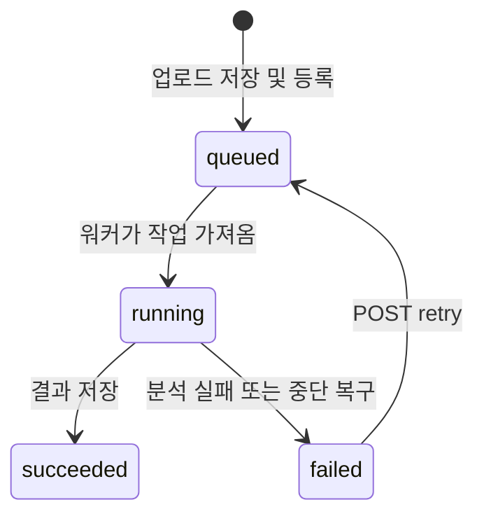

# 영상 분석 API 명세

[문서 목차](../README.md)

작성일: 2026-09-08. 현재 로컬 구현을 기준으로 정리한 첫 API 계약이다.
API와 워커의 기본 구현은 이미 존재하며, 이 문서는 클라이언트가 따라야 할 입력,
응답, 상태 전이와 현재 구현의 한계를 명시한다. 새로운 엔드포인트를 구현했다는 뜻은 아니다.
실행 방법은 [서빙 안내](serving.md)를 참고한다.

## 범위와 역할

- 기본 주소: `http://127.0.0.1:43187`. 경로에 버전 접두사는 아직 없다.
- FastAPI: 파일 저장, 작업 등록, 상태·결과 조회, 실패 작업 재등록.
- 분석 워커: SQLite에서 작업을 가져와 FFmpeg → MediaPipe → 전처리 → 선택적 GRU 실행.
- 작업 하나는 업로드된 영상 전체 하나에 대응한다. 프레임·구간별 태도 판정 API는 없다.
- 기본 모드는 `features`. 실제 태도 학습 모델이 없으므로 현재 UI도 특징 추출을 기본으로 한다.
- API와 워커는 같은 로컬 저장소를 사용한다. 원격 영상 URL이나 체크포인트를 업로드 입력으로 받지 않는다.

## 엔드포인트

| 메서드·경로 | 요청 | 성공 응답 | 의미 |
|---|---|---|---|
| `POST /jobs` | multipart `file`, query `mode` | `202 Job` | 영상 저장 및 큐 등록 완료 |
| `GET /jobs/{job_id}` | UUID 경로 | `200 Job` | 상태 및 시도 이력 |
| `GET /jobs/{job_id}/result` | UUID 경로 | `200 AnalysisResult` | 성공한 마지막 시도의 결과 |
| `POST /jobs/{job_id}/retry` | UUID 경로, 본문 없음 | `202 Job` | 실패한 작업을 같은 ID로 재등록 |
| `GET /health` | 없음 | `200 Health` | API와 DB 접근 확인 |

`202`는 분석 성공이나 판정 가능 여부를 보장하지 않는다. API에는 ML 모델이 없으며
실제 디코딩과 모델 검증은 워커가 한다. 워커가 꺼져 있어도 업로드는 접수되고 `queued`에 남는다.

## 업로드

```sh
curl -i -F 'file=@/absolute/path/to/talk.mp4' \
  'http://127.0.0.1:43187/jobs?mode=features'
```

브라우저는 `FormData`의 `file`에 파일을 넣는다. `Content-Type`의 multipart boundary는
브라우저가 생성하도록 둔다. `mode`는 JSON이나 multipart 필드가 아닌 query parameter다.

| 입력 | 계약 |
|---|---|
| `file` | 필수, 단일 영상 파일 |
| `mode` | `features` 또는 `assessment`, 생략 시 `features` |
| 확장자 | `.mp4`, `.m4v`, `.mov`, `.mkv`, `.webm`, `.avi` (대소문자 무관) |
| 파일 크기 | 기본 256 MiB; 전체 multipart 본문은 이 값 + 64 KiB |
| 처리 제한 | 기본 10,000 샘플 프레임, 디코딩 픽셀 수 최대 3840 × 2160 |

확장자가 허용돼도 실제 내용이 디코딩되지 않으면 이후 작업이 실패한다. 크기·프레임 제한은
설정 가능하며 프레임 제한 초과 시 영상을 잘라 성공시키지 않는다. FPS·이동평균 window는
클라이언트 입력이 아니다. 체크포인트 미설정 시 5 FPS·window 3, 설정 시 체크포인트 값을 쓴다.

파일을 모두 저장한 뒤 작업 ID를 발급하며 `Location: /jobs/{job_id}` 헤더를 반환한다.
파일명은 표시용이고 서버 저장 경로는 UUID로 만든다. 같은 파일을 다시 업로드하면 새 작업이다.
현재 업로드 중복 제거와 `Idempotency-Key`는 없다. 업로드 응답을 받기 전에 연결이 끊기면
접수 여부가 불명확할 수 있으므로 클라이언트가 자동 재업로드하지 않는다.

## Job 응답

다음은 형식 설명용 예시이며 실제 영상 실행 결과가 아니다. 시각은 Unix timestamp 초 단위다.

```json
{
  "id": "aabbccddeeff40118233445566778899",
  "filename": "talk.mp4",
  "source_sha256": "aaaaaaaaaaaaaaaaaaaaaaaaaaaaaaaaaaaaaaaaaaaaaaaaaaaaaaaaaaaaaaaa",
  "size_bytes": 1048576,
  "mode": "features",
  "status": "queued",
  "attempt": 0,
  "created_at": 1788825600.0,
  "updated_at": 1788825600.0,
  "attempts": [],
  "status_url": "/jobs/aabbccddeeff40118233445566778899",
  "result_url": "/jobs/aabbccddeeff40118233445566778899/result"
}
```

- `id`: 서버는 하이픈 없는 UUID를 반환한다. 경로 입력은 UUID로 검증한다.
- `status`: `queued`, `running`, `succeeded`, `failed` 중 하나.
- `attempt`: 실제로 실행을 시작한 횟수. 최초 접수는 0이며 워커가 가져갈 때 증가한다.
- `attempts`: 실행 시도 순서대로 정렬. `job_id`, `number`, `status`, `started_at`,
  `finished_at`, `error`를 포함한다. `finished_at`은 실행 중 `null`, `error`는 오류 없으면 `null`.
- 시도별 `error`는 `code`, `message`, 선택적 `type`을 가진다. 내부 경로·트레이스백은 반환하지 않는다.
- 전체 결과는 상태 응답에서 제외한다. `result_url` 존재 자체가 결과 준비 완료를 뜻하지 않는다.

## 작업 상태와 재시도



재시도는 실패한 작업에만 가능하다. 원본 파일과 작업 ID를 재사용하고, 이전 시도 오류와
산출물을 보존한다. 재등록 직후에는 이전 `attempt` 값이 유지되며 워커가 가져갈 때 증가한다.
따라서 `queued`인데 이전 실패 이력이 있는 것은 정상이다. 클라이언트는 최신 작업 `status`를
우선 표시하고 오류 이력은 별도로 표시한다. 재시도 요청을 연속 두 번 보내면 첫 요청 이후
상태가 바뀌므로 두 번째는 `409`다. 성공한 작업의 재시도는 허용하지 않는다.

워커 강제 종료 후 `running` 작업은 다음 워커 시작 시 `worker_interrupted` 오류로 실패한다.
즉시 감지하거나 자동 재실행하지 않는다. API만 재시작해도 이 상태를 바꾸지 않는다.

## AnalysisResult 응답

| 필드 | 형식·의미 |
|---|---|
| `mode` | 요청 모드 |
| `source_sha256` | 원본 파일 해시 |
| `features.sampled_frames` | 전체 샘플 프레임 수 |
| `features.sample_fps` | 실제 사용한 샘플링 FPS |
| `features.detected_frame_ratios` | `face`, `at_least_one_hand`, `two_hands`의 검출 비율 |
| `features.valid_frame_ratios` | `face`, `Left`, `Right`의 전처리 후 특징 유효 비율 |
| `features.has_valid_features` | 유효한 특징이 하나라도 있는지 |
| `features.sequence_sha256` | 저장된 특징 시퀀스 해시 |
| `assessment` | 아래 판정 상태에 따른 객체 또는 `null` |
| `notice` | 검출 비율은 태도 점수가 아니라는 설명 |

비율의 분모는 전체 샘플 프레임 수이며 값은 0~1이다. 검출 성공과 특징 유효성은 다르다.
얼굴 검출률이 낮다는 이유만으로 부적절한 태도로 바꾸지 않는다. 이 API는 통계 요약을 반환하며
원본 영상이나 전체 랜드마크 시퀀스의 다운로드 URL은 제공하지 않는다.

| 경우 | 작업 상태 | `assessment` |
|---|---|---|
| `features` 처리 완료 | `succeeded` | `null` (태도 판정 미실행) |
| `assessment`, 유효 특징 없음 | `succeeded` | `{"status":"unavailable","reason":"no_valid_features"}` |
| `assessment`, 모델 추론 완료 | `succeeded` | `status: complete`와 아래 모델 출력 |
| `assessment`, 체크포인트 미설정 | `failed` | 결과 API는 `409`, 상태 API에 실행 오류 |

판정 완료 객체의 필드는 `status`, `purpose`, `positive_class_probability`, `label_mapping`,
`frames`, `label`, `threshold`, `checkpoint_sha256`, `notice`다.
`purpose`는 `attitude_training`, 라벨은 `appropriate` 또는 `inappropriate`이며
`positive_class_probability >= 0.5`이면 `appropriate`다. 이 값은 모델 출력이고
검증된 신뢰도나 보정된 확률로 표시하지 않는다. 실제 태도 학습 데이터·성능 검증은 아직 없다.
`pipeline_smoke` 체크포인트는 워커 시작 시 거절하며 실제 영상의 태도 판정에 사용하지 않는다.

## HTTP 오류와 분석 실패

| HTTP | 경우 | 클라이언트 동작 |
|---|---|---|
| `400` | 빈 영상, 잘못된 Content-Length 또는 multipart 입력 | 입력 수정 |
| `413` | 파일 또는 전체 요청 크기 초과 | 파일 크기 축소 |
| `415` | 미지원 확장자 | 지원 파일 선택 |
| `422` | 파일 누락, 잘못된 `mode` 또는 UUID | 요청 구성 수정 |
| `404` | 해당 작업 없음 | 조회 중단, 작업 ID 확인 |
| `409` | 결과 미준비 또는 실패 상태가 아닌 작업 재시도 | 상태 API를 다시 확인 |
| `5xx` | 처리되지 않은 API/저장소 오류 | 요청 실패 표시; 작업 성공으로 간주하지 않음 |

현재 오류 응답은 FastAPI의 `detail` 형식을 따른다. `detail`은 문자열, 객체 또는
검증 오류 배열일 수 있다. 모든 오류가 동일한 `code`를 갖는 형태는 아직 아니다.

```json
{"detail":{"message":"Result is not available","status":"running"}}
```

분석 실패는 HTTP 오류와 구분한다. `GET /jobs/{job_id}` 자체는 `200`이고,
본문의 `status: failed` 및 시도별 오류로 실패를 알린다. 실행 오류 코드는 현재
`analysis_failed` 또는 `worker_interrupted`이며 상세 예외는 로컬 워커 로그에서 확인한다.
메시지 문자열을 파싱해 원인을 추측하거나 자동 재시도하지 않는다.

## 화면 연결 규칙

1. 업로드 중에는 전송 상태를 표시한다. 전송률과 영상 분석 진행률은 구분한다.
2. `202`를 받으면 작업 ID를 보관하고 `status_url`을 약 2초 간격으로 조회한다 (UI 권장값).
3. `queued`는 대기, `running`은 분석 중으로 표시한다. 현재 백분율·남은 시간은 제공하지 않는다.
4. `succeeded`면 결과를 조회하고 상태 polling을 중단한다. `assessment` 값에 따라
   특징 추출 완료 / 판정 불가 / 모델 판정 결과로 나눠 표시한다.
5. `failed`면 polling을 멈추고 오류와 재시도 버튼을 표시한다. 재시도 `202` 이후 polling을 재개한다.
6. 조회 통신 오류는 작업 실패로 바꾸지 않는다. 마지막 상태를 유지하고 연결 문제를 표시한다.

`GET /health`의 `api: ready`, `queue: sqlite`는 API·DB 접근만 뜻한다.
`worker: "separate process; not checked"`는 워커 상태를 확인하지 않았다는 명시적 값이다.
이 응답으로 모델 준비·워커 생존·전체 서비스 정상 동작을 표시하지 않는다.
배포 빌드 UI는 같은 origin의 `/ui/`에서 제공한다. 개발용 Vite 서버는 API 프록시를 사용하며 CORS는 추가하지 않았다.

## 후속 구현 순서

1. 이 계약을 Pydantic 응답 모델과 명시적인 오류 응답 선언으로 옮겨 OpenAPI 문서에 반영한다.
   현재 입력은 검증하지만 응답 스키마는 선언돼 있지 않아 `/docs`만으로 전체 필드를 알 수 없다.
2. 업로드·상태·결과 화면은 [추론 UI](../../frontend/README.md)로 구현했다. 실제 태도 모델 연결은 후속 범위다.
3. 워커 heartbeat·판정 가능 여부 조회, 요청 중복 방지, 처리 timeout·보존 정책은 후속 범위다.

공개 배포, 인증, 작업 목록·삭제·취소, 다중 워커 및 GPU 최적화는 이 첫 계약에 포함하지 않는다.

## 검증 범위

명세는 `serving/api.py`, `store.py`, `analyzer.py`, `settings.py`, `worker.py`와 대조했다.
기존 `tests/integration/test_serving.py`는 접수·상태·결과, 재시도·이력, 중단 복구,
입력 제한과 모델 재사용/체크포인트 거절을 확인한다. 이 문서 작성은 새로운 실제 영상 분석이나
실제 태도 분류 성능 검증을 수행한 것이 아니다.
